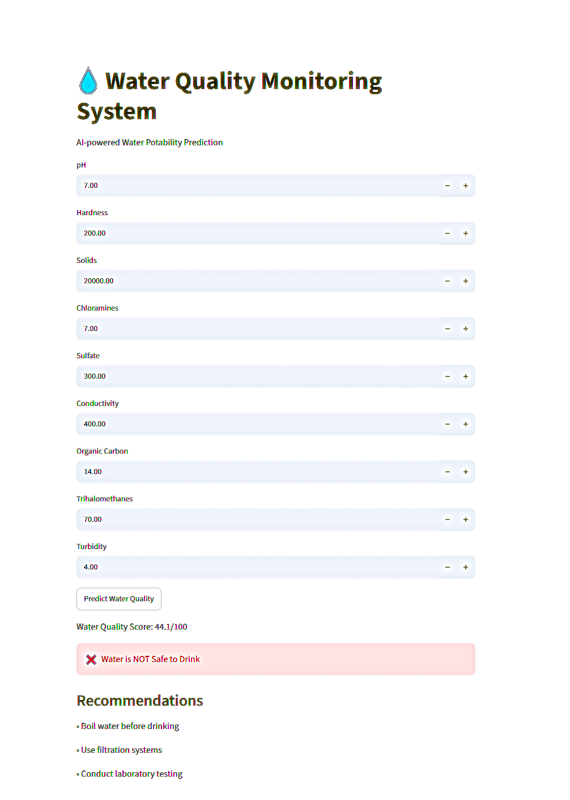

# 💧 Water Quality Monitoring System

## Application Preview



## Project Overview

This project uses Machine Learning to predict whether water is safe to drink based on various water quality parameters.

The system analyzes water properties such as pH, hardness, sulfate concentration, conductivity, and other chemical indicators to determine potability.

A Streamlit web application is provided for real-time predictions.

---

## Problem Statement

Unsafe drinking water can cause serious health issues.

The goal of this project is to build a Machine Learning model that can predict water potability and assist in water quality monitoring.

---

## Dataset

Dataset: Water Potability Dataset

Number of Records: 3276

Number of Features: 9

Target Variable:

- 0 = Not Potable
- 1 = Potable

Features:

- pH
- Hardness
- Solids
- Chloramines
- Sulfate
- Conductivity
- Organic Carbon
- Trihalomethanes
- Turbidity


---

## Exploratory Data Analysis (EDA)

### Dataset Shape

- Rows: 3276
- Columns: 10

### Missing Values Found

| Feature | Missing Values |
|----------|----------|
| ph | 491 |
| Sulfate | 781 |
| Trihalomethanes | 162 |

Missing values were handled using median imputation.

### Class Distribution

| Potability | Count |
|------------|--------|
| Not Potable (0) | 1998 |
| Potable (1) | 1278 |

Distribution:

- Not Potable: 60.99%
- Potable: 39.01%

### Feature Importance

The most important features identified by the Random Forest model were:

1. Sulfate
2. pH
3. Hardness
4. Chloramines
5. Solids

### Key Observation

No single feature showed a strong correlation with potability, indicating that water quality prediction depends on a combination of multiple factors.


---

## Machine Learning Models Tested

The following models were trained and evaluated:

### 1. Logistic Regression

Used as a baseline model for comparison.

### 2. Random Forest Classifier

Provided better performance than Logistic Regression.

### 3. XGBoost Classifier

Tested for comparison with Random Forest.

### 4. Tuned Random Forest (Final Model)

Final selected model:

- n_estimators = 300
- max_depth = 10
- min_samples_leaf = 4
- min_samples_split = 10
- class_weight = balanced

---

## Final Model Performance

| Metric | Value |
|----------|----------|
| Accuracy | 64.94% |
| Recall | 48% |
| F1 Score | 51% |
| Cross Validation Recall | 43.5% |

### Confusion Matrix

| Actual / Predicted | Not Potable | Potable |
|-------------------|------------|----------|
| Not Potable | 304 | 96 |
| Potable | 134 | 122 |

### Key Improvements

Compared to the baseline Random Forest:

- Improved Recall from 30% to 48%
- Improved F1 Score from 41% to 51%
- Better detection of potable water samples


---

## Streamlit Application

A web-based user interface was developed using Streamlit.

Users can enter water quality parameters and receive:

- Water Potability Prediction
- Water Quality Score
- Safety Recommendations

### Features

- Real-time prediction
- User-friendly interface
- AI-powered decision making
- Water quality scoring system


---

## Project Structure

```text
Water-Quality-AI/
│
├── dataset/
│   └── water_potability.csv
│
├── app.py
├── train_model.py
├── train_model_old.py
├── model.pkl
├── water_analysis.ipynb
├── requirements.txt
└── README.md

```


---
## How to Run

### Clone Repository

```bash
git clone <repository-link>
cd Water-Quality-AI
```

### Install Dependencies

```bash
pip install -r requirements.txt
```

### Train Model

```bash
python train_model.py
```

### Run Streamlit App

```bash
streamlit run app.py
```
